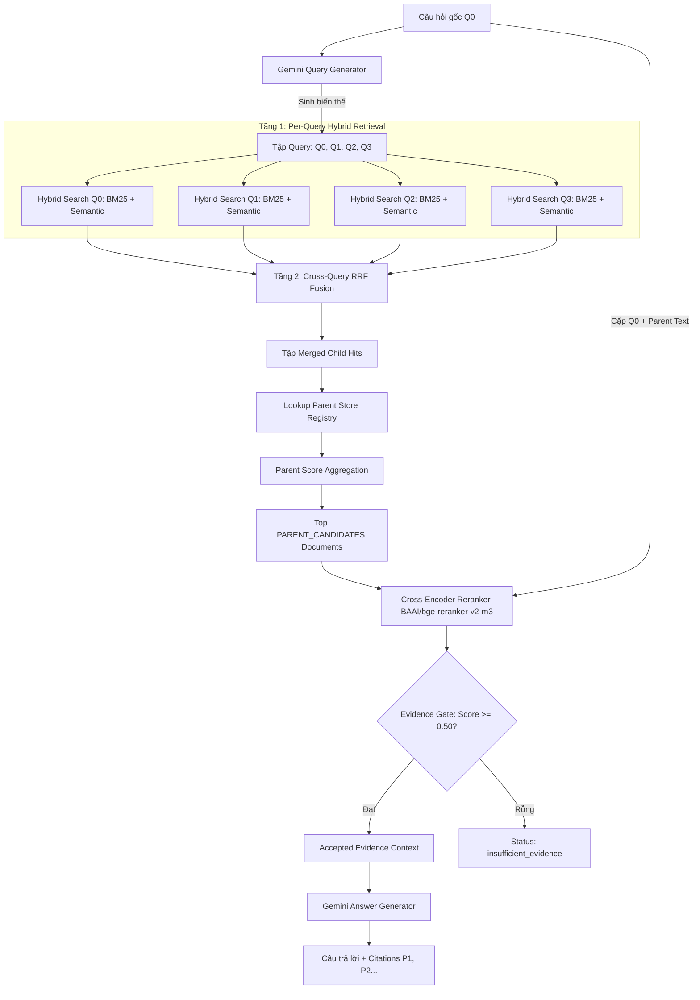

# RAG Foundation — Buổi 09: Multi-Query Expansion & Parent–Child Hierarchical Retrieval

Dự án triển khai kiến trúc RAG nâng cao **Mở rộng câu hỏi đa hướng (Multi-Query Expansion)** kết hợp **Truy xuất phân cấp Hai tầng "Retrieve Child, Return Parent"** áp dụng trên cơ sở dữ liệu văn bản pháp luật ngân hàng và thương mại quốc tế (Incoterms 2020, Quy chuẩn kỹ thuật).

---

## 📌 1. Mục Tiêu & Khác Biệt Giữa Buổi 08 và Buổi 09

| Tiêu Chí | Buổi 08 (Advanced RAG Snapshot) | Buổi 09 (Multi-Query & Parent–Child RAG) |
| :--- | :--- | :--- |
| **Xử Lý Câu Hỏi** | Truy xuất đơn hướng từ duy nhất câu hỏi gốc $Q_0$. | **Query Fan-out**: Sinh $Q_1..Q_n$ biến thể song song qua Gemini API. |
| **Đơn Vị Truy Xuất (Unit)** | Trả trực tiếp các Child Chunk độc lập (Flat Chunks). | **Retrieve Child, Return Parent**: Tìm kiếm trên Child, trả về Parent Document. |
| **Cơ Chế Fusion** | Inner RRF Fusion giữa BM25 và Semantic cho $Q_0$. | **Hai tầng Fusion**: Inner RRF trong từng query + **Cross-Query RRF** giữa $Q_0..Q_n$. |
| **Đơn Vị Reranking** | Cross-Encoder rerank trên từng Child Chunk nhỏ. | **Parent Reranking**: Cross-Encoder rerank trên toàn văn **Parent Document** với $Q_0$. |
| **Quản Lý Bối Cảnh** | Ghép các đoạn chunk rời rạc dễ mất tính toàn vẹn. | **Mở rộng ngữ cảnh phân cấp** có kiểm soát ngân sách `TOTAL_CONTEXT_MAX_CHARS`. |

---

## 🏗️ 2. Sơ Đồ Kiến Trúc Pipeline Hai Tầng Fusion & Parent Expansion



---

## 📊 3. Ma Trận So Sánh 4 Chế Độ Pipeline (Mode Comparison Matrix)

| Mode | Câu Hỏi Sử Dụng | Đơn Vị Rerank | Ngưỡng Lọc Evidence | Đơn Vị Trích Dẫn |
| :--- | :--- | :--- | :--- | :--- |
| **`single_flat`** | Câu hỏi gốc $Q_0$ | Child Chunk | `rerank_score >= 0.50` | `[C1]`, `[C2]`... |
| **`multi_flat`** | $Q_0 + Q_1..Q_n$ | Child Chunk hợp nhất | `rerank_score >= 0.50` | `[C1]`, `[C2]`... |
| **`single_parent`** | Câu hỏi gốc $Q_0$ | Parent Document | `parent_rerank_score >= 0.50` | `[P1]`, `[P2]`... |
| **`multi_parent`** *(Mặc định)* | $Q_0 + Q_1..Q_n$ | Parent Document | `parent_rerank_score >= 0.50` | `[P1]`, `[P2]`... |

---

## 📁 4. Cấu Trúc Project & Thiết Lập File `.env`

### Cấu trúc thư mục:
```text
rag_advance/buoi_09/
├── .env.example              # Mẫu biến môi trường
├── requirements.txt          # Khai báo dependency
├── rag.py                    # Primitives kế thừa từ Buổi 05
├── advanced_rag.py           # Snapshot nâng cao từ Buổi 08
├── hierarchical_rag.py       # Core module Buổi 09 (Hierarchy, Multi-Query, Parent Rerank)
├── ui_helpers.py             # Pure Python UI Data & Matrix Formatter
├── evaluate.py               # Module đánh giá định lượng Benchmark
├── app.py                    # Streamlit Comparison Dashboard
├── SPEC_buoi_09.md           # Specification kỹ thuật
├── README.md                 # Tài liệu hướng dẫn sử dụng
├── eval/
│   └── questions.json        # Tập câu hỏi đánh giá benchmark
├── reports/
│   └── latest_report.json    # Báo cáo kết quả đánh giá mới nhất
└── storage/
    ├── chroma/               # Storage vector DB ChromaDB
    ├── hierarchy/            # Parent-Child Registry (parents.json, children.json, manifest.json)
    └── huggingface/          # Local cache Cross-Encoder model
```

### Thiết lập `.env`:
Tạo file `.env` tại `rag_advance/buoi_09/.env`:
```ini
GEMINI_API_KEY=AIzaSy...
GEMINI_EMBEDDING_MODEL=gemini-embedding-2
GEMINI_GENERATION_MODEL=gemini-3.5-flash-lite
RERANKER_MODEL=BAAI/bge-reranker-v2-m3
MULTI_QUERY_COUNT=3
PER_QUERY_CANDIDATES=12
PARENT_CANDIDATES=10
FINAL_PARENT_TOP_K=3
RERANK_MIN_SCORE=0.50
PARENT_MAX_CHARS=6000
TOTAL_CONTEXT_MAX_CHARS=16000
```

---

## 🔨 5. Xây Dựng Hierarchy Store (`build-hierarchy`) & Giải Thích Warnings

Lệnh xây dựng parent–child registry deterministic:
```bash
python rag_advance/buoi_09/hierarchical_rag.py build-hierarchy
```

### Giải thích các loại Cảnh báo (Warnings):
- **`ambiguous` (Mơ hồ)**: Xuất hiện khi một Child Chunk không thể xác định duy nhất một tiêu đề Điều/Khoản do thiếu metadata hoặc heading phân cấp rõ ràng. Chunk sẽ được đưa về Parent Document mặc định của nguồn và gắn cờ `ambiguous: true`.
- **`oversized_single_child`**: Parent Document chỉ chứa đúng 1 Child Chunk nhưng kích thước Parent vượt quá `PARENT_MAX_CHARS` (mặc định 6,000 ký tự).
- **`oversized_first_parent`**: Parent đầu tiên đạt điểm cao nhất vượt quá ngân sách ngữ cảnh còn lại (`TOTAL_CONTEXT_MAX_CHARS`), nhưng được bảo lưu để tránh trả về bối cảnh rỗng.

---

## 🎯 6. Quy Ước Multi-Query Expansion & Ngân Sách API Calls

- **Schema Output Mở Rộng**:
  ```json
  {
    "original_question": "...",
    "queries": [
      {"query_id": "Q0", "text": "...", "origin": "original", "focus": "original_intent"},
      {"query_id": "Q1", "text": "...", "origin": "generated", "focus": "exact_legal_terms"},
      {"query_id": "Q2", "text": "...", "origin": "generated", "focus": "paraphrase"}
    ]
  }
  ```
- **Quy tắc an toàn**:
  - $Q_0$ luôn giữ nguyên văn câu hỏi sau NFC/Trim.
  - LLM tuyệt đối **không được bịa thêm số Điều/Khoản** chưa xuất hiện trong $Q_0$. Các query chứa số Điều/Khoản lạ sẽ bị tự động loại bỏ.
- **Ngân sách Cuộc gọi API (Generation Calls)**:
  - Tối đa **2 Gemini Generation API Calls** cho chế độ `multi_parent`: Call #1 sinh Multi-query và Call #2 sinh câu trả lời.

---

## 🧮 7. Các Công Thức Toán Học Trong Pipeline

### a) Inner RRF Fusion (Per-Query):
$$\text{inner\_rrf\_score}(d) = \frac{w_{\text{bm25}}}{K + \text{rank}_{\text{bm25}}(d)} + \frac{w_{\text{sem}}}{K + \text{rank}_{\text{sem}}(d)}$$

### b) Cross-Query RRF Fusion:
$$\text{multi\_query\_rrf\_score}(d) = \sum_{q \in Q_{\text{found}}} \frac{w_q}{\text{MULTI\_QUERY\_RRF\_K} + \text{rank}_q(d)}$$
Trong đó $w_{Q0} = 1.5$ (Original Weight) và $w_{Q_i} = 1.0$ (Variant Weight).

### c) Parent Score Aggregation:
$$\text{parent\_rrf\_score}(P) = \sum_{c \in \text{Top Child}(P)} \text{multi\_query\_rrf\_score}(c)$$
Giới hạn lấy tối đa `PARENT_SCORE_CHILD_LIMIT` (mặc định 3) Child Chunks tốt nhất cho mỗi Parent.

---

## 🔍 8. Quy Trình "Retrieve Child, Return Parent" & Parent Reranking

1. **Truy xuất**: Nhận Child Chunks từ Cross-Query RRF Fusion.
2. **Ánh xạ**: Tra cứu `parent_id` duy nhất từ registry cho từng Child Chunk.
3. **Reranking Parent**:
   - Mẫu đầu vào Cross-Encoder: **`(original_question, parent_text)`**.
   - Chuẩn hóa điểm số:
     $$\text{parent\_rerank\_score} = \text{sigmoid}(\text{logit}) = \frac{1}{1 + e^{-\text{logit}}}$$
   - Lọc qua cổng `RERANK_MIN_SCORE >= 0.50`.

---

## 💻 9. Hướng Dẫn Các Lệnh CLI

Chạy các lệnh từ thư mục gốc `RAG/`:

```bash
# 1. Kiểm tra trạng thái hệ thống
python rag_advance/buoi_09/hierarchical_rag.py status

# 2. Xây dựng Parent-Child Registry
python rag_advance/buoi_09/hierarchical_rag.py build-hierarchy

# 3. Thử nghiệm sinh Multi-Query Expansion
python rag_advance/buoi_09/hierarchical_rag.py expand-query --question "Điều kiện giao hàng CIP quy định bảo hiểm ra sao?"

# 4. Tìm kiếm Cross-Query Child Hits
python rag_advance/buoi_09/hierarchical_rag.py multi-child --question "Điều kiện giao hàng CIP quy định bảo hiểm ra sao?"

# 5. Truy xuất Parent Documents
python rag_advance/buoi_09/hierarchical_rag.py parent-retrieve --question "Điều kiện giao hàng CIP quy định bảo hiểm ra sao?" --mode multi_parent

# 6. Hỏi đáp RAG Hoàn chỉnh (Full Pipeline)
python rag_advance/buoi_09/hierarchical_rag.py query --question "Điều kiện giao hàng CIP quy định bảo hiểm ra sao?" --mode multi_parent

# 7. So sánh 4 Mode (Retrieval-Only)
python rag_advance/buoi_09/hierarchical_rag.py compare --question "Điều kiện giao hàng CIP quy định bảo hiểm ra sao?"

# 8. Thực thi Benchmark Đánh Giá Định Lượng
python rag_advance/buoi_09/evaluate.py --top-k 3

# 9. Khởi chạy Streamlit Comparison Dashboard
python -m streamlit run rag_advance/buoi_09/app.py --server.port 8509
```

---

## 📏 10. Giải Thích Các Tham Số K & Context Budget

- `PER_QUERY_CANDIDATES` (mặc định 12): Số lượng Child Hits lấy ra từ mỗi câu hỏi thành phần $Q_i$.
- `PARENT_CANDIDATES` (mặc định 10): Số lượng Parent Documents đưa vào Cross-Encoder Reranker.
- `FINAL_PARENT_TOP_K` (mặc định 3): Số lượng Parent Documents tối đa đưa vào ngữ cảnh sinh câu trả lời.
- `PARENT_MAX_CHARS` (mặc định 6,000): Ký tự tối đa của một Parent Document đơn lẻ.
- `TOTAL_CONTEXT_MAX_CHARS` (mặc định 16,000): Ký tự tổng tối đa của toàn bộ ngữ cảnh đưa vào LLM Answer Generator.

---

## 📈 11. Đánh Giá Định Lượng Benchmark & Giới Hạn Gold Labels

- Các chỉ số đo đạc: `Child Recall@K`, `Parent Recall@K`, `MRR@K`, `nDCG@K`, `Latency (ms)` và `Context Expansion Factor`.
- **Giới hạn nhãn chuẩn (Gold Labels)**: Tập câu hỏi đánh giá gắn cờ `needs_human_review = true`. Do đó, kết quả benchmark phản ánh xu hướng tương quan định lượng giữa các mode, **không được tự ý tuyên bố mode multi_parent thắng tuyệt đối** khi chưa có sự xác nhận của chuyên gia pháp lý.

---

## 🛠️ 12. Hướng Dẫn Khắc Phục Sự Cố (Troubleshooting)

1. **Lỗi `hierarchy_not_ready`**:
   - Nguyên nhân: Chưa chạy build hierarchy hoặc file lưu trữ bị hỏng.
   - Xử lý: Chạy `python rag_advance/buoi_09/hierarchical_rag.py build-hierarchy`.
2. **Lỗi `reranker_unavailable`**:
   - Nguyên nhân: Thiếu thư viện `transformers`/`torch` hoặc hết bộ nhớ GPU/RAM.
   - Xử lý: Kiểm tra nạp model CPU hoặc cài đặt đúng dependency trong `requirements.txt`.
3. **Latency truy xuất cao**:
   - Nguyên nhân: Sinh nhiều câu hỏi biến thể hoặc model Reranker lớn.
   - Xử lý: Giảm `MULTI_QUERY_COUNT` xuống 2 hoặc giảm `PARENT_CANDIDATES` xuống 5.

---

## ⚖️ 13. Tuyên Bố Từ Chối Trách Nhiệm Pháp Lý (Legal Disclaimer)

> **LƯU Ý PHÁP LÝ**: Hệ thống RAG này được thiết kế phục vụ mục đích nghiên cứu, học thuật và thử nghiệm công nghệ phân tích dữ liệu nâng cao. Câu trả lời do hệ thống sinh ra **KHÔNG ĐƯỢC COI LÀ LỜI KHUYÊN PHÁP LÝ CHÍNH THỨC** hay văn bản hướng dẫn nghiệp vụ ngân hàng có giá trị pháp lý. Người dùng cần đối chiếu với văn bản quy phạm pháp luật gốc do Ngân hàng Nhà nước và các cơ quan thẩm quyền ban hành trước khi ra quyết định nghiệp vụ.
