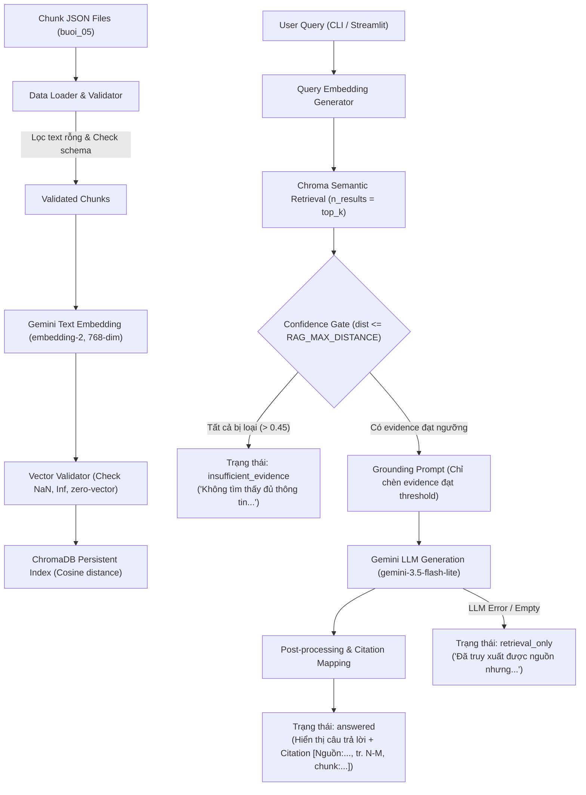

# Buổi 07: RAG Application Production-Ready Refactoring

Hệ thống RAG Chatbot hoàn chỉnh được chuẩn hóa theo tiêu chuẩn Production: Kiểm soát chất lượng dữ liệu đầu vào (Validation), Vector Embedding với Gemini API, lưu trữ Persistent Index bằng ChromaDB, truy vấn Semantic Retrieval có Confidence Gate và trích dẫn thông tin chính xác (Strict Citation Mapping).

---

## 1. Mục tiêu
- Xây dựng pipeline RAG tin cậy, ngăn chặn hiện tượng hallucination (tự bịa thông tin) của LLM.
- Đảm bảo dữ liệu đầu vào tuân thủ Data Contract nghiêm ngặt trước khi index.
- Tự động hóa quá trình sinh trích dẫn (citation) lấy trực tiếp từ metadata thực tế lưu trong ChromaDB.
- Cung cấp cả giao diện người dùng Streamlit (`app.py`), CLI tiện lợi (`rag.py`) và bộ test tự động phủ 100% kịch bản kiểm thử (`tests/test_rag.py`).

---

## 2. Quan hệ với Buổi 05 và Buổi 06
- **Buổi 05**: Nơi chứa dữ liệu chunks đã được tiền xử lý (`rag_foundation/buoi_05/output/chunks/`) và môi trường ảo Python (`rag_foundation/buoi_05/.venv/`). Buổi 07 chỉ đọc dữ liệu từ Buổi 05, tuyệt đối không chỉnh sửa dữ liệu hoặc code của Buổi 05.
- **Buổi 06**: Thư mục bài học tham chiếu trước đó. Buổi 07 kế thừa và refactor lại kiến trúc RAG theo tiêu chuẩn Production chuyên nghiệp mà không sửa đổi file nào thuộc Buổi 06.

---

## 3. Sơ đồ Pipeline (System Flow)



---

## 4. Cấu trúc Thư mục Dự án

```text
rag_foundation/buoi_07/
├── SPEC_buoi_07.md             # Tài liệu thiết kế chi tiết (Agent Specification)
├── buoi_07.md                  # Hướng dẫn thứ tự các bước thực hiện
├── README.md                   # Hướng dẫn tổng quan & nghiệm thu (File này)
├── rag.py                      # Core Module: Loader, Validator, Embedding, Indexer & Query CLI
├── app.py                      # Giao diện ứng dụng Streamlit RAG Chatbot
├── requirements.txt            # Danh sách thư viện bắt buộc (Phiên bản tương thích)
├── .env.example                # Mẫu file biến môi trường
├── .env                        # File biến môi trường chứa API Key thực tế (Không commit)
├── .gitignore                  # Cấu hình bỏ qua file nhạy cảm và temporary storage
├── storage/                    # Thư mục lưu trữ Chroma Vector Database
│   ├── .gitkeep
│   └── chroma/                 # ChromaDB Persistent Storage Data
└── tests/                      # Thư mục kiểm thử tự động
    ├── __init__.py
    ├── fixtures/
    │   └── chunks_sample.json  # Dữ liệu giả lập mẫu cho unit testing
    └── test_rag.py             # Unittest Suite (Phủ 47 mandatory test cases)
```

---

## 5. Điều kiện Đầu vào (Prerequisites)
1. Đã hoàn thành Buổi 05 và có sẵn thư mục `rag_foundation/buoi_05/output/chunks/`.
2. Máy tính có cài đặt Python từ 3.11 trở lên.
3. Có Gemini API Key từ Google AI Studio.

---

## 6. Cách sử dụng Python Virtual Environment (`.venv`) Buổi 05

Buổi 07 tái sử dụng trực tiếp môi trường Python `.venv` của Buổi 05:

- **Linux / macOS**:
  ```bash
  /Users/thuvan/Agribank/DaoTaoTapHuan/Ứng dụng AI phân tích dữ liệu nâng cao/Agribank-rag2/RAG/rag_foundation/buoi_05/.venv/bin/python
  ```
- **Windows PowerShell**:
  ```powershell
  rag_foundation\buoi_05\.venv\Scripts\python.exe
  ```

---

## 7. Cách cài đặt Requirements

Sử dụng đúng Python interpreter của Buổi 05 để cài đặt gói thư viện trong `requirements.txt`:

- **Linux / macOS**:
  ```bash
  /Users/thuvan/Agribank/DaoTaoTapHuan/Ứng dụng AI phân tích dữ liệu nâng cao/Agribank-rag2/RAG/rag_foundation/buoi_05/.venv/bin/python -m pip install -r rag_foundation/buoi_07/requirements.txt
  ```
- **Windows PowerShell**:
  ```powershell
  rag_foundation\buoi_05\.venv\Scripts\python.exe -m pip install -r rag_foundation\buoi_07\requirements.txt
  ```

---

## 8. Cách tạo `.env` từ `.env.example`

Sao chép file mẫu `.env.example` thành `.env` trong thư mục `rag_foundation/buoi_07/`:

- **Linux / macOS**:
  ```bash
  cp rag_foundation/buoi_07/.env.example rag_foundation/buoi_07/.env
  ```
- **Windows PowerShell**:
  ```powershell
  Copy-Item rag_foundation\buoi_07\.env.example -Destination rag_foundation\buoi_07\.env
  ```

Mở file `rag_foundation/buoi_07/.env` và điền Gemini API Key của bạn:
```env
GEMINI_API_KEY=AIzaSy...
```

---

## 9. Giải thích Chi tiết Các Biến Môi Trường

| Biến môi trường | Giá trị mặc định | Giải thích |
|---|---|---|
| `GEMINI_API_KEY` | *(Để trống)* | Key cá nhân từ Google AI Studio dùng để gọi API Embedding & LLM. |
| `GEMINI_EMBEDDING_MODEL` | `gemini-embedding-2` | Tên model tạo vector biểu diễn ngữ nghĩa cho văn bản. |
| `GEMINI_EMBEDDING_DIM` | `768` | Số chiều (dimensionality) của vector embedding (128 đến 3072). |
| `GEMINI_GENERATION_MODEL` | `gemini-3.5-flash-lite` | Tên model LLM dùng để tổng hợp câu trả lời tiếng Việt. |
| `DEFAULT_TOP_K` | `5` | Số lượng đoạn văn bản liên quan nhất cần truy xuất từ ChromaDB. |
| `RAG_MAX_DISTANCE` | `0.45` | Ngưỡng khoảng cách Cosine tối đa để chấp nhận một evidence. |

---

## 10. Lệnh Validate Dữ Liệu Chunks

Kiểm tra tính hợp lệ của dữ liệu JSON trước khi index:

- **Linux / macOS**:
  ```bash
  /Users/thuvan/Agribank/DaoTaoTapHuan/Ứng dụng AI phân tích dữ liệu nâng cao/Agribank-rag2/RAG/rag_foundation/buoi_05/.venv/bin/python rag_foundation/buoi_07/rag.py validate --strategy hierarchical
  ```
- **Windows PowerShell**:
  ```powershell
  rag_foundation\buoi_05\.venv\Scripts\python.exe rag_foundation\buoi_07\rag.py validate --strategy hierarchical
  ```

---

## 11. Lệnh Kiểm Tra Trạng Thái Index (Status)

Thao tác Read-only kiểm tra trạng thái cấu hình và Chroma Collection:

- **Linux / macOS**:
  ```bash
  /Users/thuvan/Agribank/DaoTaoTapHuan/Ứng dụng AI phân tích dữ liệu nâng cao/Agribank-rag2/RAG/rag_foundation/buoi_05/.venv/bin/python rag_foundation/buoi_07/rag.py status --strategy hierarchical
  ```
- **Windows PowerShell**:
  ```powershell
  rag_foundation\buoi_05\.venv\Scripts\python.exe rag_foundation\buoi_07\rag.py status --strategy hierarchical
  ```

---

## 12. Lệnh Index Dữ Liệu vào ChromaDB

Thực hiện tạo embedding và lưu vào Chroma Persistent Storage:

- **Linux / macOS**:
  ```bash
  /Users/thuvan/Agribank/DaoTaoTapHuan/Ứng dụng AI phân tích dữ liệu nâng cao/Agribank-rag2/RAG/rag_foundation/buoi_05/.venv/bin/python rag_foundation/buoi_07/rag.py index --strategy hierarchical
  ```
- **Windows PowerShell**:
  ```powershell
  rag_foundation\buoi_05\.venv\Scripts\python.exe rag_foundation\buoi_07\rag.py index --strategy hierarchical
  ```

---

## 13. Lệnh Reset Collection Đích rồi Index

Xóa chỉ riêng collection đích và thực hiện index lại từ đầu:

- **Linux / macOS**:
  ```bash
  /Users/thuvan/Agribank/DaoTaoTapHuan/Ứng dụng AI phân tích dữ liệu nâng cao/Agribank-rag2/RAG/rag_foundation/buoi_05/.venv/bin/python rag_foundation/buoi_07/rag.py index --strategy hierarchical --reset
  ```
- **Windows PowerShell**:
  ```powershell
  rag_foundation\buoi_05\.venv\Scripts\python.exe rag_foundation\buoi_07\rag.py index --strategy hierarchical --reset
  ```

---

## 14. Lệnh Hỏi Đáp RAG qua CLI (Query)

Chạy truy vấn câu hỏi bằng command line:

- **Linux / macOS**:
  ```bash
  /Users/thuvan/Agribank/DaoTaoTapHuan/Ứng dụng AI phân tích dữ liệu nâng cao/Agribank-rag2/RAG/rag_foundation/buoi_05/.venv/bin/python rag_foundation/buoi_07/rag.py query --strategy hierarchical --top-k 5 --question "Quy định về thời hạn trả nợ như thế nào?"
  ```
- **Windows PowerShell**:
  ```powershell
  rag_foundation\buoi_05\.venv\Scripts\python.exe rag_foundation\buoi_07\rag.py query --strategy hierarchical --top-k 5 --question "Quy định về thời hạn trả nợ như thế nào?"
  ```

---

## 15. Lệnh Chạy Bộ Kiểm Thử Tự Động (Unittest Suite)

Khởi chạy toàn bộ 42 test suite methods (phủ 47 mandatory test cases):

- **Linux / macOS**:
  ```bash
  /Users/thuvan/Agribank/DaoTaoTapHuan/Ứng dụng AI phân tích dữ liệu nâng cao/Agribank-rag2/RAG/rag_foundation/buoi_05/.venv/bin/python -m unittest discover -s rag_foundation/buoi_07/tests -v
  ```
- **Windows PowerShell**:
  ```powershell
  rag_foundation\buoi_05\.venv\Scripts\python.exe -m unittest discover -s rag_foundation\buoi_07\tests -v
  ```

---

## 16. Lệnh Chạy Giao Diện Streamlit App

Mở giao diện web tương tác:

- **Linux / macOS**:
  ```bash
  /Users/thuvan/Agribank/DaoTaoTapHuan/Ứng dụng AI phân tích dữ liệu nâng cao/Agribank-rag2/RAG/rag_foundation/buoi_05/.venv/bin/python -m streamlit run rag_foundation/buoi_07/app.py
  ```
- **Windows PowerShell**:
  ```powershell
  rag_foundation\buoi_05\.venv\Scripts\python.exe -m streamlit run rag_foundation\buoi_07\app.py
  ```

---

## 17. Giải thích Thuật ngữ Kỹ thuật

1. **Strategy**: Phương pháp cắt nhỏ văn bản (`hierarchical`: theo cấu trúc phân cấp; `semantic`: theo đoạn ngữ nghĩa; `fixed-size`: theo độ dài cố định).
2. **Embedding Model**: Mô hình học máy chuyển đổi đoạn văn bản thành mảng các số thực chứa ý nghĩa ngữ nghĩa.
3. **Embedding Dimension**: Độ dài mảng số thực (độ phân giải vector). Cần hoàn toàn khớp giữa Index và Query.
4. **Collection Identity**: Tên định danh độc bản cho Chroma Collection (kết hợp strategy, dimension và hash của model, ví dụ `nhnn-hierarchical-768-fec74714`).
5. **Top-K**: Số lượng mảng vector tương đồng nhất được truy xuất từ cơ sở dữ liệu.
6. **Cosine Distance**: Đo lường khoảng cách giữa 2 vector. Khoảng cách càng gần 0 thể hiện hai đoạn văn bản càng giống nhau về mặt ý nghĩa.
7. **RAG_MAX_DISTANCE**: Ngưỡng khoảng cách tối đa cho phép chấp nhận một đoạn tài liệu (mặc định `0.45`).
8. **Confidence Gate**: Lớp bảo vệ kiểm tra khoảng cách của các vector retrieved; loại bỏ các tài liệu không đạt threshold trước khi gửi sang LLM.
9. **Retrieval-Only**: Trạng thái hệ thống đã tìm được nguồn tài liệu nhưng quá trình sinh câu trả lời tự động gặp lỗi hoặc bị gián đoạn.
10. **Citation**: Chuỗi trích dẫn minh bạch được tự động thay thế bằng code (`[Nguồn: <source>, tr. <N hoặc N-M>, chunk: <chunk_id>]`).

---

## 18. Cách Dừng Tiến Trình Streamlit

Tại cửa sổ Terminal đang chạy ứng dụng Streamlit, nhấn tổ hợp phím **`Ctrl + C`** để dừng dịch vụ.

---

## 19. Hướng dẫn Khắc Phục Lỗi (Troubleshooting)

- **Lỗi thiếu Package**: Chạy lại lệnh cài đặt requirements theo Mục 7.
- **Lỗi sai Python Interpreter**: Đảm bảo đường dẫn lệnh bắt đầu đúng bằng `.venv/bin/python` (macOS/Linux) hoặc `.venv\Scripts\python.exe` (Windows).
- **Lỗi thiếu API Key**: Kiểm tra file `rag_foundation/buoi_07/.env` đã có dòng `GEMINI_API_KEY=AIza...` chưa.
- **Lỗi Collection rỗng**: Chạy lệnh `index` (Mục 12) trước khi chạy `query`.
- **Lỗi Model / Dimension Mismatch**: Chạy lệnh `index` với tham số `--reset` (Mục 13) để khởi tạo lại Collection.
- **Lỗi Cú pháp JSON**: Kiểm tra file JSON nguồn trong `buoi_05/output/chunks/` bằng lệnh `validate` (Mục 10).
- **Lỗi Rate Limit API Gemini**: Chờ 1-2 phút trước khi gửi lại truy vấn hoặc kiểm tra hạn ngạch trên Google AI Studio.

---

## 20. Giới Hạn của Demo
- Ứng dụng tập trung vào kiến trúc cốt lõi RAG Production (Validation, Vector Store, Confidence Gate, Citation Mapping).
- Chưa tích hợp các tính năng nâng cao như HyDE, Reranking (Cross-Encoder), hay Graph RAG.

---

## 21. Cảnh Báo An Toàn & Bảo Mật

> [!CAUTION]
> 1. **KHÔNG PHẢI TƯ VẤN PHÁP LÝ**: Thông tin do RAG Chatbot trả về chỉ mang tính chất tham khảo học tập, không thay thế cho tư vấn pháp lý chính thức.
> 2. **HIỆU CHỈNH THRESHOLD**: Giá trị `RAG_MAX_DISTANCE = 0.45` cần được tinh chỉnh thực nghiệm theo từng tập dữ liệu cụ thể.
> 3. **BẢO MẬT DỮ LIỆU**: Các đoạn văn bản khi embedding hoặc generation sẽ được gửi tới dịch vụ Gemini của Google. Chỉ đưa các dữ liệu công khai/được phép sử dụng lên API bên ngoài.

---

## 22. Kế Hoạch Kiểm Thử Thủ Công (Manual Test Plan)

Thực hiện chạy thử nghiệm thủ công 3 câu hỏi đại diện trên giao diện UI hoặc CLI:

### Câu A (Trong phạm vi tài liệu):
> `"Cơ cấu lại thời hạn trả nợ được quy định như thế nào?"`
- **Kỳ vọng**: Trích xuất được các chunk liên quan, Confidence Gate chấp nhận, sinh câu trả lời kèm trích dẫn `[Nguồn: ..., tr. N-M, chunk: ...]`.

### Câu B (Trong phạm vi tài liệu):
> `"Việc phân loại nợ và trích lập dự phòng được thực hiện như thế nào?"`
- **Kỳ vọng**: Trích xuất đúng tài liệu phân loại nợ, status `answered`, hiển thị đầy đủ nguồn tham khảo.

### Câu C (Ngoài phạm vi tài liệu):
> `"Ngân hàng nào có lãi suất tiết kiệm cao nhất hôm nay?"`
- **Kỳ vọng**: Các đoạn văn bản truy xuất có Cosine Distance cao hơn ngưỡng `RAG_MAX_DISTANCE (0.45)` $\rightarrow$ Confidence Gate chặn lại $\rightarrow$ Trạng thái **`insufficient_evidence`** $\rightarrow$ Hệ thống phản hồi: *"Không tìm thấy đủ thông tin liên quan trong tài liệu đã cung cấp."* (Tuyệt đối không bịa tên ngân hàng hoặc lãi suất).
